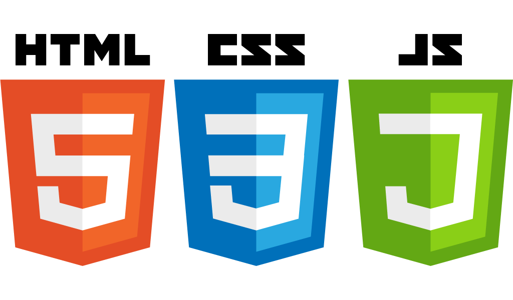
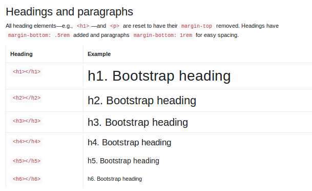
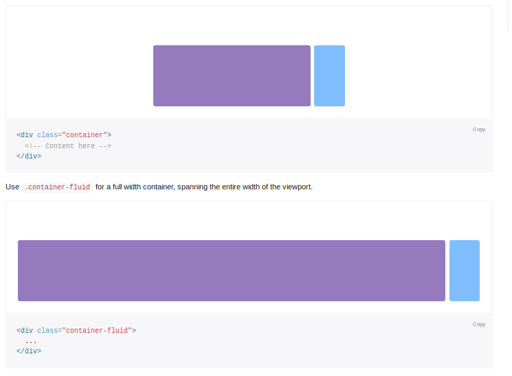
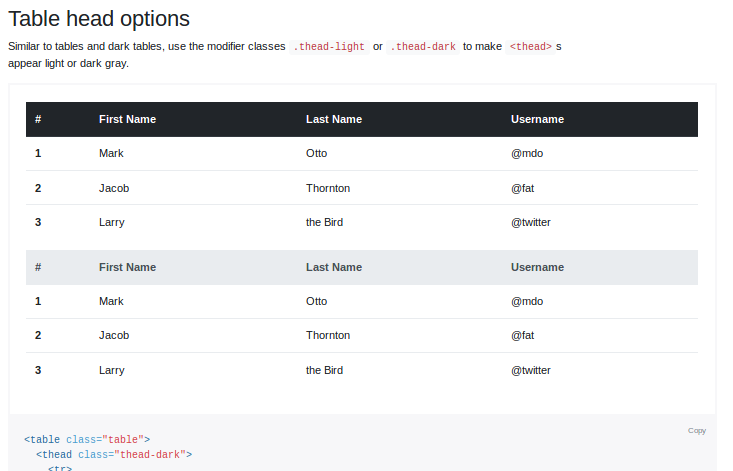
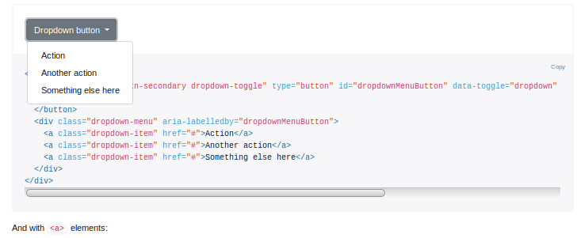
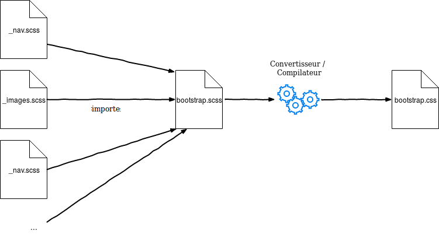
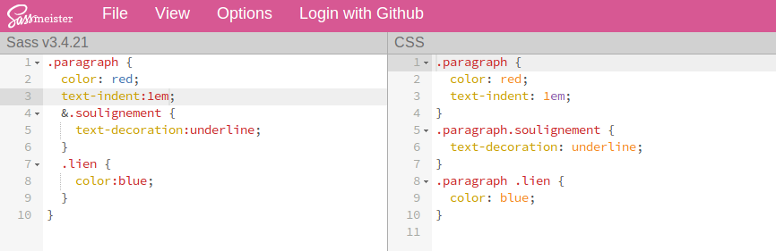

Les frameworks front-end
===

# 

## Cours École Nationale des Chartes n°2414

### Master Technologies Numériques Appliquées à l'Histoire

*Présentation créée sous Marp*

---

# Objectifs du cours

- Donner les moyens de prototyper graphiquement une application web rapidement
- Comprendre les notions de 
	- frameworks,
	- front-end
	- back-end

---

# La notion de front-end

"Client/Server Overview", *Mozilla Dev*, https://developer.mozilla.org/en-US/docs/Learn/Server-side/First_steps/Client-Server_overview

# 

---

## Client

| Langages Principaux | Langages secondaires |
| ------------------- | -------------------- |
| HTML5               | XML                  |
| CSS3                | XSL/XSLT             |
| Javascript ES7\*    |                      |

\* : EcmaScript

---

## Client

- HTML : Structuration de l'information
- CSS
	- Style
	- Structuration graphique de la page
- Javascript
	- Traiter du texte en live (convertir du texte en markdown ou html : éditeurs WYSIWYG)
	- Récupérer des informations sur d'autres sites, 
	- Réaliser des objets complexes, d'une carte à un carroussel/slideshow

---

# La notion de framework

- Ensemble de composant permettant de développer rapidement l'architecture d'un logiciel
- Framework (Ensembles de pièces fondatrices) != Librairie (ou bibliothèques ) qui sert un but précis (exemple : afficher une carte)

---

# La notion de framework

__Défaut__ : il conditionne le résultat final (forme, architecture)
__Avantage__ : Il permet de développer très rapidement les bases d'une application.

---

# Les frameworks front-end

- BLONDIN Alexis, "Introduction aux frameworks front-end (Bootstrap, Foundation)", *AltiCreations*,  https://www.alticreation.com/bootstrap-foundation-frameworks-front-end/
- Snippet = Morceau de Code

---

## Les frameworks : la typographie

---

## Les frameworks : l'agencement (_layout_)

---

## Les frameworks : les composants

---

## Les frameworks : les widgets

---

## SCSS/SASS, LESS et CSS

---

## SASS

__Avantages :__ hiérarchie, variables, inclusion, etc.
__Désavantage :__ compilation

Via SassMeister.com

---

# Avantages des frameworks front-end

1. Gain de temps
2. Standardisation et performances
3. Évolutivité et mises à jour
4. Gratuit et libre
5. Fiabilité

<small>d'après BLONDIN Alexis, *op. cit.*</small>

---

# Défauts des frameworks front-end

1. Des sites qui se ressemblent
2. Du code unitilisé qui alourdit les pages
3. Nécessité de modifier ou ajouter du code
4. Modifier ou adapter le code originel du framework peut être long voire laborieux
5. Risque de conflits avec d'autres bibliothèques ou plugins

<small>d'après BLONDIN Alexis, *op. cit.*</small>

---

# Quelques exemples

| Nom | Addresse | Github.com/ |
| --- | -------- | ------ |
| __Bootstrap__ | getbootstrap.com | twbs/bootstrap |
| Foundation | foundation.zurb.com | zurb/foundation-sites |
| SemanticUI | semantic-ui.com | Semantic-Org/Semantic-UI |
