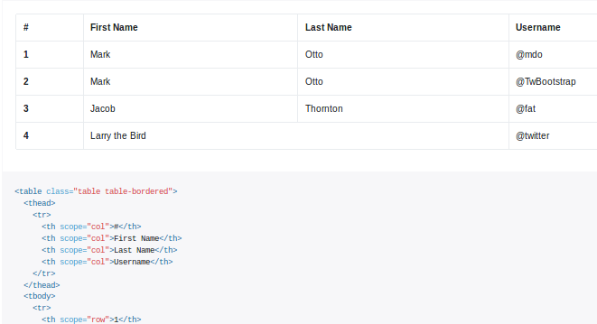
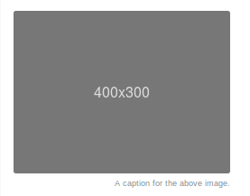
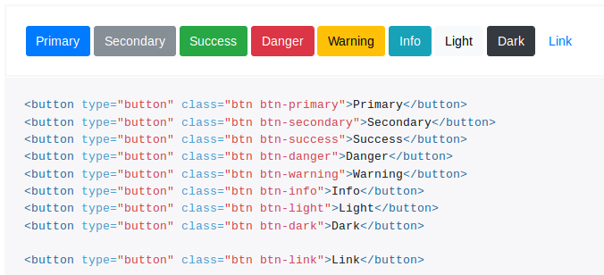
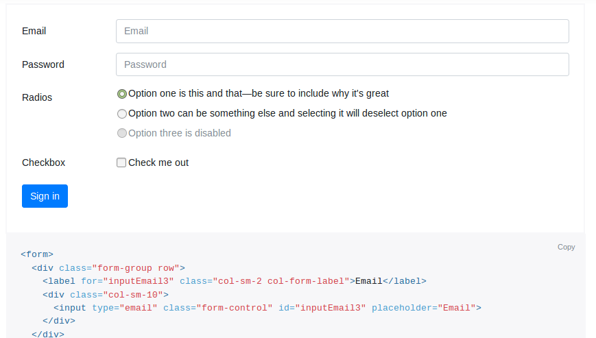
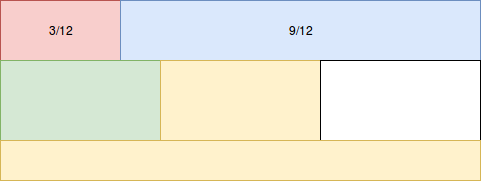
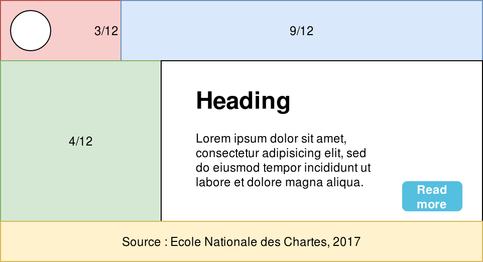
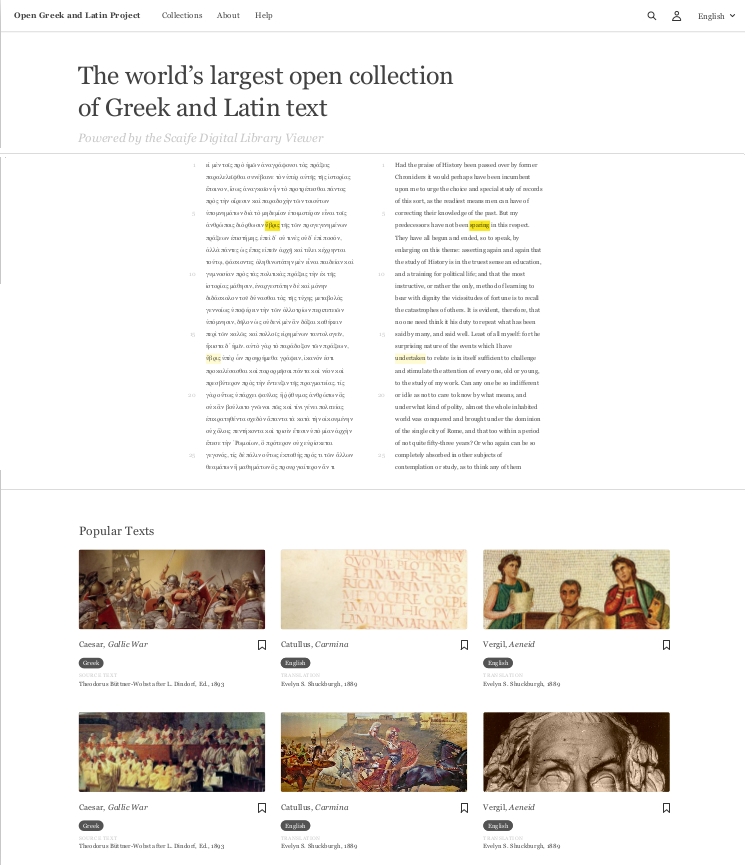
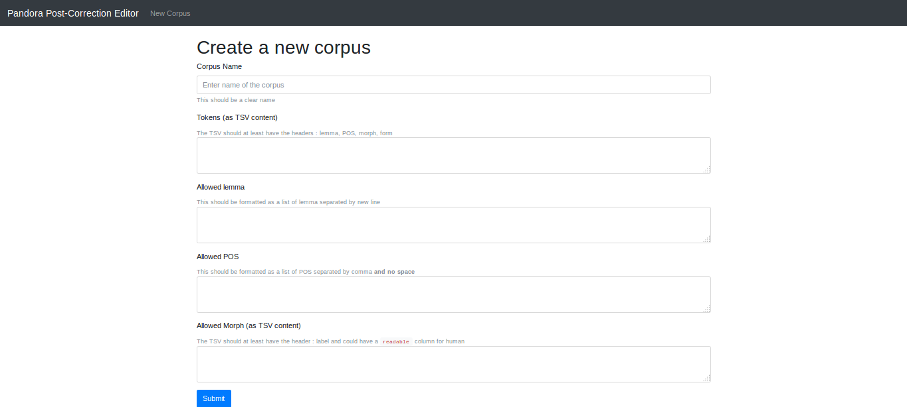
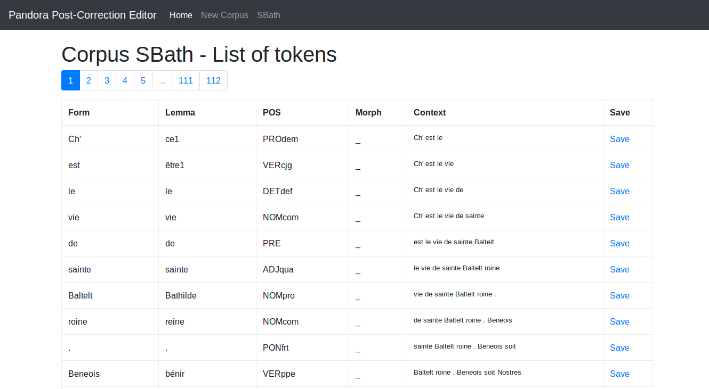

Bootstrap comme _framework front-end_
===


https://getbootstrap.com - http://fontawesome.io/

---

# Bootstrap

Version 4, développée par _Twitter_

http://getbootstrap.com/docs/4.0/getting-started/introduction/

<small><small>

```html
<!doctype html>
<html lang="en">
  <head>
    <title>Hello, world!</title>
    <!-- Required meta tags -->
    <meta charset="utf-8">
    <meta name="viewport" content="width=device-width, initial-scale=1,
    shrink-to-fit=no">

    <!-- Bootstrap CSS -->
    <link rel="stylesheet" href="./css/bootstrap.min.css">
  </head>
  <body>
    <!-- JavaScript Optionnel -->
    <!-- jQuery first, then Popper.js, then Bootstrap JS -->
    <script src="./js/popper.3.2.1.slim.min.js" type="text/javascript"></script>
    <script src="./js/popper.1.12.3.min.js" type="text/javascript"></script>
    <script src="./js/bootstrap.min.js" type="text/javascript"></script>
  </body>
</html>
```
</small>
</small>

---

## Bootstrap : le système de layout et de grille

### 2 types de conteneur/d'agencements : 
- fluide : pour chaque pixel d'aggrandissement de la fenêtre, les éléments s'adaptent.
- fixe : à certaines tailles de fenêtre (576px, 768px, 992px, 1200px et +), la taille du conteneur change

### Un système de colonnes
- Une division de l'espace en 12 colonnes
- Une goutière de 30 px
		- 15 à droite de la colonne de gauche
		- 15 à gauche de la colonne de droite

---

## Quelques exemples d'éléments pratiques

### Les tables : la classe `.table` et l'option `.table-bordered`



---

### Les figures 

<table>
<tr>
<td style="font-size:smaller;">

```html
<figure class="figure">
  
  <figcaption 
    class="figure-caption text-right">
    A caption for the above image.
  </figcaption>
</figure>
```

</td>
<td></td>
</tr>
</table>

--- 

### Les boutons



---

### Les formulaires 

https://getbootstrap.com/docs/4.0/components/forms/




---

### Exercice 1 (Exemple de réalisation) :

Réaliser un ensemble fixe 2 puis 3 colonnes puis 1 colonne tel que suit :



---

### Exercice 2 :

Image ronde à partir de https://github.com/PonteIneptique/cours-css-framework/blob/master/images/ex2_image.png

 

---

# Exercice 3

<small> github.com/PonteIneptique/cours-css-framework/blob/master/images/ex3.png  </small> 

 

---

### Exercice 4

 

---

### Exercice 5

 
